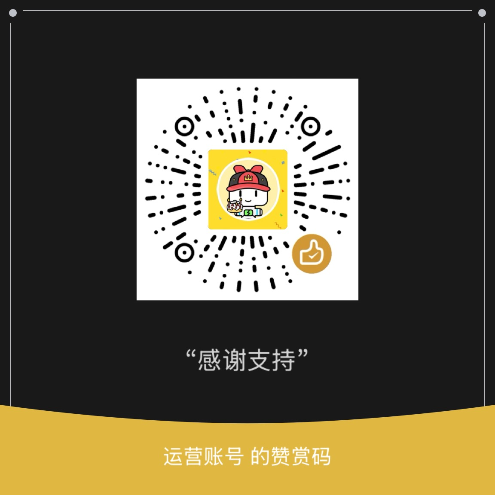

# 推送订阅（WeCom / Feishu / DingTalk Pusher）

个人自用的推送工具：**仅机器人（Webhook）单渠道**，现已支持**企业微信 / 飞书 / 钉钉**三种机器人。支持 RSS 自动推送、自定义内容立即推送、定时推送（每天/每周/每月/每年）、公开订阅/退订、源分类标签，并可嵌入其他网站作为订阅小组件。纯 EdgeOne（Pages Functions + KV + schedules），零数据库、零 npm 依赖、免费档可跑。

## 功能
- 前端填「自己的机器人 Webhook」+ 勾选订阅的 RSS 源 / 自定义内容频道（均带分类标签）→ 存 KV
- **多平台**：企业微信群机器人、飞书机器人、钉钉机器人（地址格式自动识别）
- RSS 自动推送：cron 每 5 分钟轮询，新条目推给订阅了该源的人
- **夜间静默 + 早报**：21:00–06:00 不推 RSS（防骚扰），期间更新缓存，**早 8 点聚合为一封「早安播报」**；自定义内容/频道/群发不受静默影响，照常发送
- **订阅者自设关键词**：每个订阅者可填最多 10 个关键词，只收标题/摘要命中的 RSS（自定义内容频道不受关键词影响）
- **自定义内容频道**：管理员建多个频道（可各自定时 + 预设内容），订阅者勾选具体频道；发内容只推给该频道订阅者
- 定时群发（给所有人）：管理员公告类定时推送
- 定时推送：日/周/月/年，cron 评估后执行（频道定时 + 群发定时）
- 公开订阅 / 退订（退订链接带 token）
- 管理端可**查看订阅列表（机器人地址脱敏）+ 删除指定订阅**
- 轻量统计：每个源/频道累计成功/失败次数（非逐条日志）
- **零成本埋点**：前端 UV 每日去重(cookie)+PV 10% 采样 + 嵌入(widget)计数，服务端 `/api/track` 做每日聚合（KV 单值、写频可控），可在管理端「数据概览」查看漏斗（pv/uv/widget/sub/unsub）。
- 订阅 / 收藏接口带 **每 IP 限流**（订阅 30 次/时、收藏 50 次/时）
- 订阅人数接近上限时返回提醒
- 可嵌入第三方网站（`?widget=1` 精简视图 + CORS）
- **收藏推送小工具**（线上路径 `/bookmark`，原 `index_bookmark.html` 仍兼容）：手机端手填机器人 + 标题/链接立即推给自己（不存储）；PC 端提供「书签栏小工具（bookmarklet）」——拖到书签栏后，在任意网页一点即抓取标题+链接（+选中文字）推到机器人。支持「记住机器人」（本机 localStorage），书签打开后自动推送并自动关页。
- **移动端一键（Android PWA）**：站点可「添加到主屏幕」安装为应用，之后用系统分享任意网页 → 选本应用 → 自动打开 `/bookmark?title&content&url` 预填并推送（替代 PC bookmarklet 的移动端一键）。iOS Safari 暂不支持 share_target，仍用手动填写。
- **合规底部**：每个网页底部展示 ICP 备案（豫ICP备2024069686号，跳工信部备案系统）与公网安备（豫公网安备41132402411815号，跳公安备案平台），并提供「投放广告联系管理员」链接。
- **底部广告位 + 管理**：页面底部预留广告位，管理员在「管理」页可直接粘贴 JS/HTML 广告片段并一键启用/关闭（存 KV `ad_config`，页面客户端拉取渲染，支持广告 `<script>` 自动执行）。
- **SEO 友好**：每页注入 description/keywords/OpenGraph/canonical/JSON-LD 结构化数据；提供 `/robots.txt` 与 `/sitemap.xml`（含 `lastmod`，已收录 5 个高意图场景落地页 `/scenario-*`：GitHub→飞书、RSS→企微、告警→钉钉、早报→飞书、网页收藏），利于搜索引擎长尾收录。
- **响应头加固**：全站返回 `X-Content-Type-Options: nosniff` / `Referrer-Policy` / `Permissions-Policy`；静态页与 `robots`/`sitemap`/`manifest` 走边缘缓存（`Cache-Control`），`sw.js` 设 `no-cache`，API 设 `no-store`。**未启用 `X-Frame-Options`/`CSP frame-ancestors`**，以保留首页 `?widget=1` 被第三方网站 iframe 嵌入的能力。
- **PWA 图标**：`/icon.svg` 被 manifest 引用，让 Android「添加到主屏幕」安装横幅正常出现。

## 目录结构
```
wecom-pusher/
├── edgeone.json              # schedules：每 5 分钟触发 /api/cron/tick
├── index.html                # 前端源（订阅页 + 管理页 + 退订 + widget 模式）
├── index_bookmark.html       # 收藏推送小工具源（推给自己，无存储）
├── gen_pages.cjs            # 把源 HTML + 场景落地页内嵌成 functions 里的页面函数（源 HTML 为单一真源）
└── functions/
    ├── _lib.js               # 共享工具：KV/多平台推送/RSS/调度/CORS/哈希/限流/脱敏
    ├── index.js              # 页面：/（由 index.html 生成）
    ├── bookmark.js           # 页面：/bookmark（由 index_bookmark.html 生成）
    ├── index_bookmark.html.js# 页面：/index_bookmark.html（旧链接兼容，由 index_bookmark.html 生成）
    ├── robots.txt.js         # /robots.txt
    ├── sitemap.xml.js        # /sitemap.xml
    ├── manifest.webmanifest.js # /manifest.webmanifest（PWA + share_target + icons）
    ├── icon.svg.js          # /icon.svg（PWA 安装图标，manifest 引用）
    ├── sw.js.js              # /sw.js（最小 Service Worker，用于可安装性）
    ├── scenario-*.js         # /scenario-<slug>（SEO 长尾场景落地页，由 gen_pages.cjs 生成）
    └── api/
        ├── subscribe.js      # 公开订阅（含关键词）/ 退订 / 人数
        ├── sources.js        # RSS 源列表(含分类) / 增删（admin）
        ├── channels.js       # 自定义内容频道列表 / 增删（admin）
        ├── push.js           # 发布到频道 / 群发 / 定时群发（admin）
        ├── subs.js           # 订阅列表(脱敏) / 删除（admin）
        ├── bookmark.js       # 收藏推送（即时推给自己，无存储）
        ├── ad.js             # 底部广告配置 GET(公开)/ POST(admin)
        ├── track.js          # 零成本埋点接收端（PV/UV/嵌入/订阅/退订，每日聚合）
        └── cron/tick.js      # 定时任务执行器（RSS静默/早报 + 频道 + 群发）
```

## 免费档容量（实测推算）
EO KV 单命名空间限额：**1 万写 / 10 万读 每天、1GB 存储、单值最大 25MB**；免费 Edge Functions：**300 万请求 / 300 万 ms CPU**。

| 维度 | 免费档上限 | 实际可用 |
|------|-----------|----------|
| 订阅者数 | 单值 25MB → 约 **10 万**（单值）；1GB 命名空间 | 个人/小站：**几万无压力**，超 10 万需分片 |
| RSS 源数 | 单值 25MB → 约 10 万 | 几十~几千轻松 |
| 每日新增订阅（写次数） | **1 万/天** | 稳态人数不受限，只限"每天新加多少人" |
| 读取 | 10 万/天 | 当前设计每 5 分钟读数次 ≈ 千/天，几乎用不完 |
| 函数请求/CPU | 300 万 / 300 万 ms | cron 288/天 + API，富余极大 |
| 平台侧限流 | 机器人约 20 条/分/机器人（企微） | **单人单机器人是真实瓶颈，非 EO** |

> 结论：免费档对"人数/源数"几乎不构成瓶颈（受 25MB 单值约束约 10 万）；真正要盯的是**每日新增订阅的写次数（1 万/天）**与**机器人自身限流**。代码在订阅者 > 9 万或数据 > 22MB 时会返回 `warn` 并在管理页提示。

## 部署步骤
1. **开通 KV**：EdgeOne 控制台 → KV 存储 → 申请开通 → 创建命名空间。把该命名空间绑定到本项目，**绑定变量名必须设为 `KV`**（代码里用的是全局 `KV`）。
2. **设置环境变量**：项目 → 环境变量，新增 `ADMIN_TOKEN`（随便一段高强度字符串，管理端要用）。**不要把真实值写进仓库里的 `.env`**；本仓库只提供 `.env.example` 作模板，`ADMIN_TOKEN` 一律在 EdgeOne 控制台配置（Functions 通过 `context.env` 读取，不依赖文件）。
3. **部署**（任选其一）：
   - **CLI**：`npm install -g edgeone` → 在项目目录 `edgeone pages link` → `edgeone pages deploy`
   - **Git 自动构建**：把本目录推到仓库，在 EO Pages 关联仓库，push 即部署
   - **EdgeOne Makers 网页导入**：直接导入本文件夹
4. 部署后 `edgeone.json` 里的 schedules 会自动建好定时任务（时区 Asia/Shanghai）。

## 使用
1. 打开站点，切到「管理」：填 ADMIN_TOKEN → 添加一个 RSS 源（名称 + RSS 地址 + 可选分类）。
2. 切到「订阅」：填你的机器人 Webhook（企微/飞书/钉钉群 → 添加群机器人 → 复制地址）→ 勾选源与频道 → 可选填关键词 → 订阅。
3. 新 RSS 条目会推到你的机器人（夜间静默、早 8 点合并早报）。也可在「管理」里发立即推送或定时推送。
4. 退订：把订阅时返回的 `id`+`token` 拼成 `https://你的域名/?unsub=ID&token=TOKEN` 访问即可。
5. 管理端「订阅管理」可查看所有订阅（机器人地址脱敏）+ 删除指定订阅。
6. 收藏推送：打开 `/bookmark`（旧地址 `index_bookmark.html` 仍可用），填自己机器人 + 标题/链接，立即推给自己。

## 嵌入其他网站（小组件）
本应用已开启 CORS，订阅接口可被跨域调用。第三方站点用 iframe 嵌入精简订阅页：
```html
<iframe
  src="https://你的域名/?widget=1&source=源ID"
  style="width:100%;height:480px;border:0"
  title="订阅推送"></iframe>
```
- `?widget=1`：隐藏标签页与管理页，只显示订阅表单（适合嵌入）。
- `&source=源ID`：预选某个源（源 ID 在管理页添加源后由接口返回，或读 `/api/sources` 获取）。
- 其他网站用户在此填入**他们自己的**机器人地址即可订阅，数据存入你的 KV。

> ⚠️ 公开订阅有滥用风险（垃圾 bot 地址刷库、冒用他人机器人）。当前已做：平台 URL 格式校验 + 每 IP 限流（订阅 30/时、收藏 50/时）。若要正式对外开放嵌入，建议再加：可选 **CAPTCHA**、以及源维度的订阅统计/封禁。

## SEO 与移动端 PWA

### 搜索引擎收录
- 两个页面均已注入 `description` / `keywords` / OpenGraph / `canonical` / JSON-LD（`WebApplication`）结构化数据；正文为服务端直出（非 JS 渲染），爬虫可直接读取。
- `/robots.txt` 允许全站抓取并指向 `/sitemap.xml`；`/sitemap.xml` 列出 `/` 与 `/bookmark`。
- canonical / sitemap 使用生产域名 `https://sub.jinbufenzi.com/`，请确认该自定义域名已在 EO 控制台**绑定到本项目并已生效**（证书已生效即可）。

### 移动端一键（Android）
- 浏览器打开站点 → 菜单「添加到主屏幕」安装为 PWA。
- 之后在任意网页用系统「分享」→ 选择「推送订阅」→ 自动打开 `/bookmark?title&content&url` 并（若已记住机器人）自动推送、自动关页。
- 原理：`/manifest.webmanifest` 的 `share_target` + 最小 `/sw.js` 满足 PWA 可安装性；书签页本就支持 URL 参数预填与自动推送。
- ⚠️ iOS Safari 不支持 `share_target`，移动端 iOS 仍用手动填写（或 PC bookmarklet）。这是平台限制，EO 侧无法绕过。

## 赞赏支持
如果这个项目对你有帮助，欢迎扫码赞赏支持开发者继续维护：



> 你的支持是这个项目持续迭代的最大动力 ☕  — 也欢迎 Star / Issue / PR。

## 注意 / 局限（MVP）
- RSS 解析为极简实现，覆盖绝大多数 RSS 2.0 / Atom；冷门格式可能漏解析。
- 订阅者/源/定时推送都以 JSON 数组整存整取（单 key），未做复杂查询；接近 25MB 单值上限需分片。早报缓存按源单独存（`digest:<源ID>`）。
- 退订 token、限流计数均为轻量实现（非加密强度），个人自用足够；高安全场景建议加密钥。
- 时区固定 Asia/Shanghai（中国无夏令时）。静默窗口 21:00–06:00、早报 08:00 均为北京时间。
- 关键词过滤仅作用于 RSS；自定义内容/频道/群发为管理员显式内容，不过滤。
